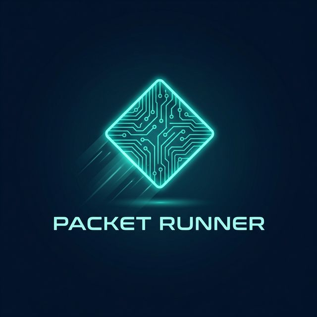

# 🌐 Packet Runner

**Packet Runner** is a fast-paced, cybersecurity-themed puzzle game built with **Phaser 3**. You take control of a data packet traversing a complex network, avoiding malware, navigating through firewalls, and optimized routing to deliver your payload safely to the server.



## 🚀 Gameplay Overview

In **Packet Runner**, you navigate a network of nodes. Each move costs **TTL (Time To Live)**, and colliding with malware or firewalls will damage your **Integrity**. Your goal is to reach the **Target Server** with the highest possible integrity and remaining time.

### 🎮 Features
- **Dynamic Network Events**: Traffic spikes, EMP bursts, and zero-day detections keep the gameplay unpredictable.
- **Specialized Nodes**:
  - ⚡ **Switches**: Provide a speed boost for faster traversal.
  - 🧭 **Routers**: Analyze the network to show you the best path.
  - 🔐 **VPNs**: Automatically encrypt your packet with a shield.
  - 🔒 **Firewalls**: Require precise timing to pass through.
- **Power-ups**: Collect **Encryption Shields** and **TTL Restores** to stay alive longer.
- **Combo System**: String together fast moves to multiply your score.

## 🕹 Controls

- **Mouse Click**: Click on an adjacent node to move the packet.
- **Keyboard [1-9]**: Press the corresponding number label on an adjacent node to move quickly.
- **Hover**: Preview links and congestion before moving.

## 🛠 Tech Stack

- **Engine**: [Phaser 3](https://phaser.io/)
- **Bundler**: [Vite](https://vitejs.dev/)
- **Language**: JavaScript (ES6+)

## 🔧 Installation & Setup

1. **Clone the repository**:
   ```bash
   git clone https://github.com/royysoans/Packet-Runner.git
   cd Packet-Runner
   ```

2. **Install dependencies**:
   ```bash
   npm install
   ```

3. **Run in development mode**:
   ```bash
   npm run dev
   ```

4. **Build for production**:
   ```bash
   npm run build
   ```

---

*Developed by Royston Soans. Secure the network. Run the packet.*
